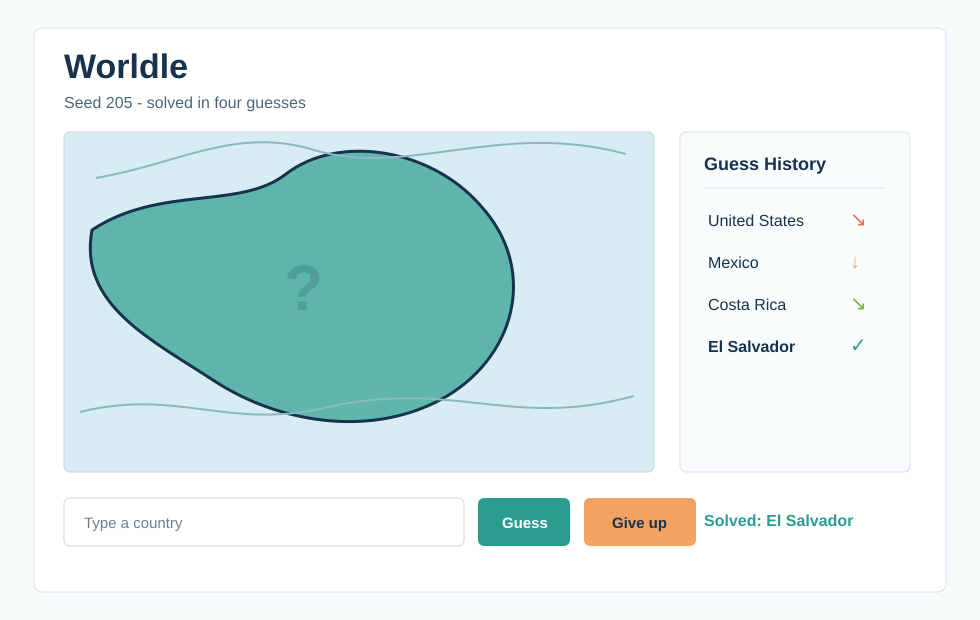

# Worldle Submission Notes

## Implemented `wdo` Functions

- `wdo.geometry.bbox`: finished coordinate flattening, feature bounding boxes, multi-feature bounding boxes, and bbox polygon conversion.
- `wdo.maps.leaflet_helpers`: implemented `ipyleaflet` map creation, GeoJSON layers, viewport fitting, controls, bbox drawing, and paths.
- `wdo.games.worldle`: implemented target selection, country centers, guess feedback, formatted feedback, country/flag lookup, guess-row HTML, proximity colors, and share text.

## Lookup Aliases

The polygon data includes ISO-2 and ISO-3 properties, so most flags join directly by ISO-2. I also added normalized name matching and aliases for common mismatches such as `United States of America` to `United States`, `Czech Republic` to `Czechia`, and `Democratic Republic of the Congo` to `DR Congo`.

## Known Bugs

- Bounding-box centers are fast but not perfect for antimeridian countries or countries with far-away territories.
- Some disputed zones and special territories have no flag in the flag-icon dataset; the game still works and displays a text fallback.
- The interactive game requires `ipyleaflet` and `ipywidgets` in the Jupyter environment.

## Screenshot

